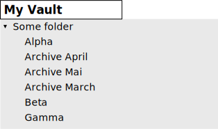

Yet to be filled with content ;-)

See [syntax-reference.md](./syntax-reference.md), maybe that file has already some content?

---
Some sections added ad-hoc, to be integrated later

# Advanced features

## Priorities of sorting groups

At run-time, when the custom sorting is triggered (explicitly or automatically) each folder item (a file or a sub-folder) is evaluated against the sorting groups.
The evaluation (matching) is done in the order in which the sorting groups are defined in `sorting-spec: |` for the folder.

That means, for example, that the sorting group `/:files ...` will match _all_ files - in turn, none of files has a chance to match further rule

Consider the below example:
```yaml
---
sorting-spec: |
  target-folder: Some folder
       // The below sorting group captures (matches) all files
  /:files ...
       // The below sorting group should (theoretically) capture files with names starting with 'Archive' word
       //   yet none of files will have a chance to reach the rule, because the previous sorting group will match all files
       //   Hence, the below sorting group is void
  /:files Archive...
---
```

The resulting order of notes would be:



However, a group can be assigned a higher priority in the sorting spec. In result, folder items will be matched against them _before_ any other rules. To impose a priority on a group use the prefix `/!` or `/!!` or `/!!!`

The modified example would be:
```yaml
---
sorting-spec: |
  target-folder: Some folder
       // The below sorting group captures (matches) all files
  /:files ...
       // The below sorting group captures files with names starting with 'Archive' word
       //   and thanks to the priority indicator prefix '/!' folder items are matched against it
       //   before matching the previous sorting group
  /! /:files Archive...
---
```

and it would result in the expected order of items:


For clarity: the three available prefixes `/!` or `/!!` or `/!!!` allow for futher finetuning of sorting groups matching order, the `/!!!` representing the highest priority value

